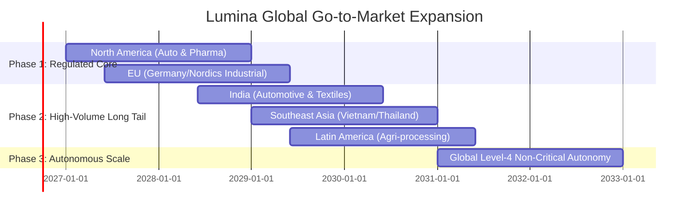
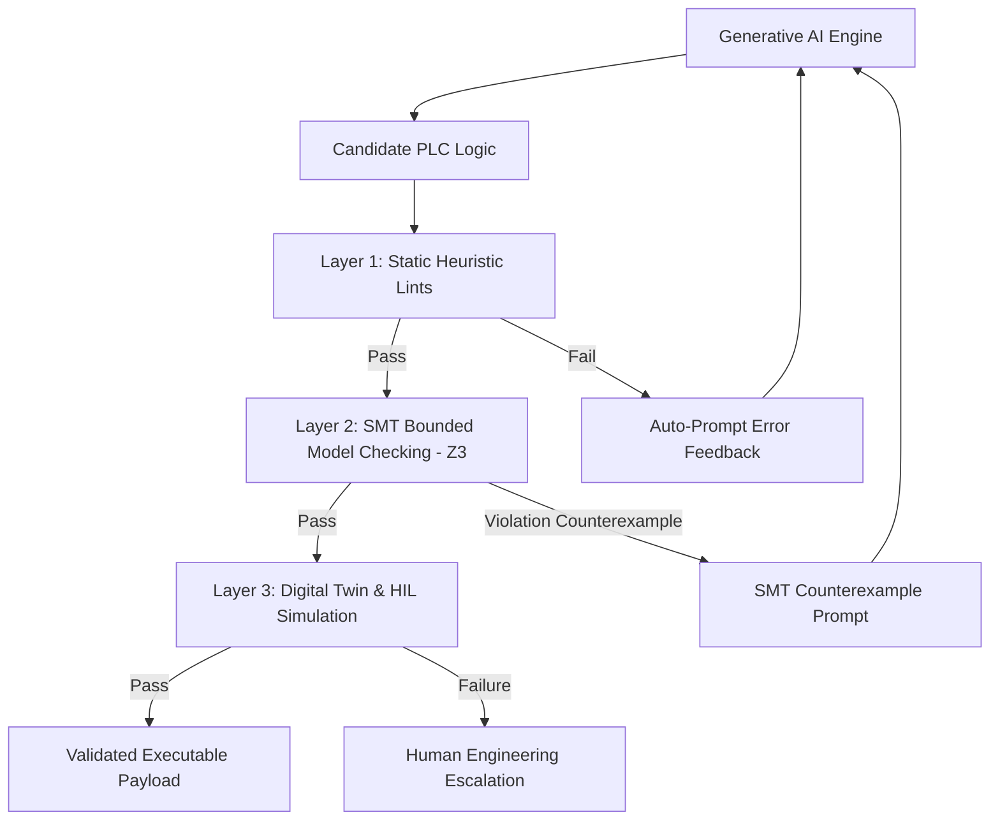
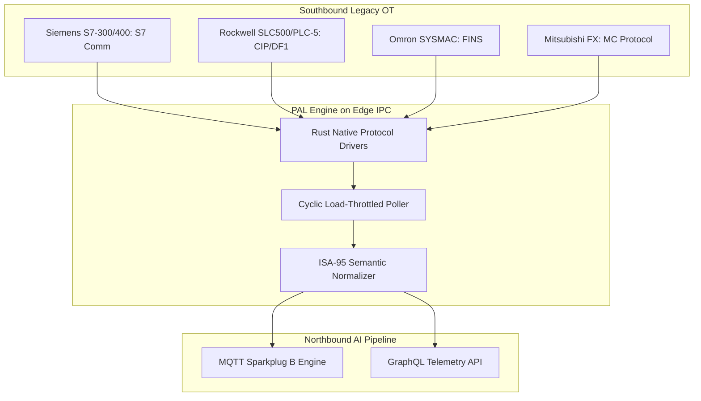
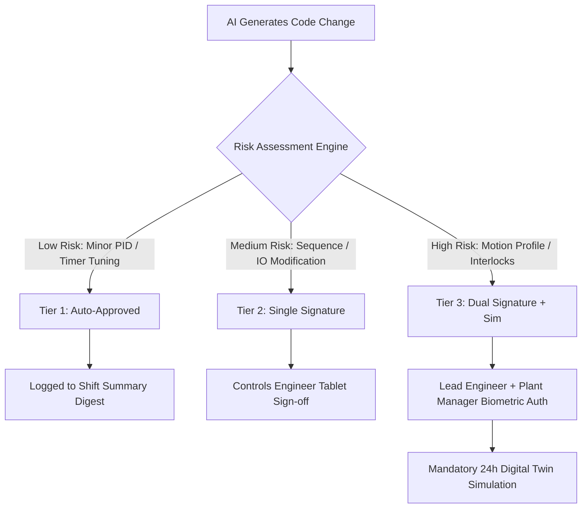
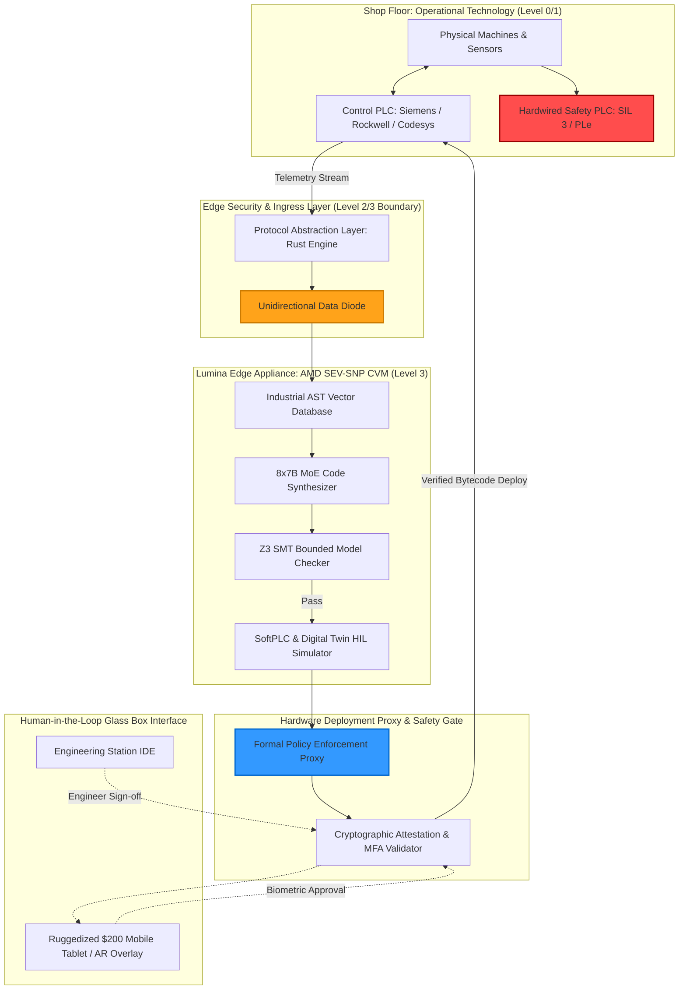

# Project Lumina: The Universal Master Research Paper
## Autonomous Industrial PLC Code Generation, Verification, Security, and Lifecycle Management System

**Document Version:** 2.0 (Universal Synthesis)  
**Classification:** Technical & Strategic Master Specification  
**Domains Covered:** Business Strategy & Market Entry, AI/ML Architecture, Industrial Automation & OT Integration, ICS Cybersecurity & Systems Architecture, Product Design & Human-AI UX  

---

## Table of Contents
1. [Executive Summary & Strategic Vision](#1-executive-summary--strategic-vision)
2. [Market Economics & Business Strategy](#2-market-economics--business-strategy)
   - 2.1 The Incumbent Fallacy & The Industrial Long Tail
   - 2.2 The "Trojan Horse" Market Entry Strategy
   - 2.3 Legal Liability, Shared Risk & Cyber-Physical Insurance
   - 2.4 Tiered Monetization Model & SI Token Economy
   - 2.5 Defensible Moats & Compounding Network Effects
   - 2.6 Grounded Financial ROI Model
   - 2.7 Global Expansion Roadmap (2027–2032)
3. [AI/ML Architecture & Semantic Verification Engine](#3-aiml-architecture--semantic-verification-engine)
   - 3.1 Foundation Model Paradigm & Domain Tokenization
   - 3.2 The 3-Layer Verification Gauntlet (Heuristic $\rightarrow$ SMT Bounded Model Checking $\rightarrow$ HIL)
   - 3.3 Industrial Retrieval-Augmented Generation (RAG) Architecture
   - 3.4 Simulation-Driven Self-Play & RLSF Data Bootstrapping
   - 3.5 Edge Serving Engine: Multi-LoRA Batching & Speculative Decoding
   - 3.6 Resilient Agentic Loop & Failure Recovery Matrix
   - 3.7 Continuous Learning without Catastrophic Forgetting
4. [Industrial Automation & OT Integration](#4-industrial-automation--ot-integration)
   - 4.1 The Hard Determinism Boundary (250µs vs. Asynchronous AI)
   - 4.2 Engineering Toolchain Realities (Siemens TIA Portal & Rockwell Studio 5000)
   - 4.3 AST-Driven Schema-Validated Code Generation (L5X & SCL)
   - 4.4 Universal Protocol Abstraction Layer (PAL) for Brownfield PLCs
   - 4.5 Functional Digital Twins via High-Frequency Process Mining
   - 4.6 AI-Assisted Automated Commissioning (Computer Vision + NLP)
   - 4.7 Software PLCs (TwinCAT 3 & Codesys) as AI-Native Targets
5. [Systems Architecture, Hardware Tiers & ICS Cybersecurity](#5-systems-architecture-hardware-tiers--ics-cybersecurity)
   - 5.1 Confidential Computing: AMD SEV-SNP Virtual Machines
   - 5.2 Hardware-Enforced Proxy & Unidirectional Data Diodes
   - 5.3 Live Deployment Realities & State-Preservation Mechanics
   - 5.4 Model Supply Chain Integrity & Provenance Attestation
   - 5.5 Minimum Viable Autonomous Action & Safety PLC Air-Gapping
   - 5.6 Cognitive AI Meta-Monitoring & Drift Detection
   - 5.7 Threat Matrix (MITRE ATT&CK for ICS) & Incident Recovery
   - 5.8 Tiered Hardware Deployment Matrix
6. [Product Design & "Glass Box" Human-AI Collaboration](#6-product-design--glass-box-human-ai-collaboration)
   - 6.1 Brand Identity: *Lumina*
   - 6.2 The "Glass Box" Trust Interface & Causal Narratives
   - 6.3 Tailored Persona Interfaces (Plant Manager, Controls Engineer, C-Suite)
   - 6.4 3-Tier Risk-Based Approval Workflow
   - 6.5 Conversational Natural Language Maintenance Interface
   - 6.6 4-Step Onboarding Wizard & Augmented Reality Field Overlay
   - 6.7 Thin-Client Browser Architecture
7. [Comprehensive System Architecture Diagram](#7-comprehensive-system-architecture-diagram)
8. [Conclusion & Master Roadmap](#8-conclusion--master-roadmap)

---

## 1. Executive Summary & Strategic Vision

The manufacturing and critical infrastructure sectors face an acute structural crisis: a worsening global shortage of qualified automation and controls engineers, compounding legacy codebase technical debt, and multi-billion-dollar annual losses from unplanned downtime ($260,000/hour average across manufacturing; over $2,000,000/hour in automotive).

**Project Lumina** establishes the first comprehensive, end-to-end framework for an **Autonomous Programmable Logic Controller (PLC) Code Generation, Verification, and Lifecycle Management System**. Moving beyond superficial "code chatbots" and naive theoretical models, Lumina bridges the fundamental divide between probabilistic generative AI and the deterministic, safety-critical realities of Operational Technology (OT).

Lumina operates on five core architectural pillars:
1. **Grounded Economics:** Accessible, tiered deployment starting at $500/month, powered by a "Trojan Horse" entry strategy (read-only diagnostics $\rightarrow$ automated code generation).
2. **Mathematically Guaranteed Safety:** Replacing naive compiler checks with a rigorous 3-layer verification gauntlet featuring **Z3 SMT Bounded Model Checking (BMC)** and Hardware-in-the-Loop (HIL) simulation.
3. **Pragmatic OT Interoperability:** A Universal Protocol Abstraction Layer (PAL) supporting legacy brownfield protocols (S7 Comm, FINS, MC Protocol, CIP) alongside modern standards (OPC UA, MQTT Sparkplug B), paired with robust workarounds for proprietary vendor APIs (Siemens TIA Portal, Rockwell Studio 5000).
4. **Hardware-Enforced Zero-Trust Security:** Running within **AMD SEV-SNP Confidential Virtual Machines**, strictly isolated behind physical data diodes and hardware-enforced deployment proxies, with absolute air-gapping from Safety Instrumented Systems (SIL 2/3).
5. **The "Glass Box" Human-in-the-Loop UX:** An explainable, causal interface delivering tailored dashboards for plant managers, control engineers, and C-suite executives on standard $200 industrial tablets.

```
       ┌────────────────────────────────────────────────────────┐
       │                    PROJECT LUMINA                      │
       │     Autonomous Industrial Control Intelligence         │
       └───────────────────────────┬────────────────────────────┘
                                   │
      ┌────────────────────────────┼────────────────────────────┐
      │                            │                            │
┌─────┴───────────────┐  ┌─────────┴─────────────┐  ┌───────────┴────────────┐
│ 1. MARKET & GTM     │  │ 2. AI/ML & VERIFY     │  │ 3. OT INTEGRATION      │
│ • Trojan Horse GTM  │  │ • MoE + AST RAG       │  │ • Legacy PAL (S7/FINS) │
│ • Tiered Pricing    │  │ • Z3 SMT Model Check  │  │ • AST XML Gen (L5X)    │
│ • Insurer Backing   │  │ • Sim Self-Play Data  │  │ • Process Mining Twin  │
└─────────────────────┘  └───────────────────────┘  └────────────────────────┘
      │                            │                            │
      └────────────────────────────┼────────────────────────────┘
                                   │
                  ┌────────────────┴───────────────┐
                  │ 4. ZERO-TRUST CYBERSECURITY    │
                  │ • AMD SEV-SNP Confidential VMs │
                  │ • Hardware Data Diodes         │
                  │ • Safety PLC Air-Gapping       │
                  └────────────────┬───────────────┘
                                   │
                  ┌────────────────┴───────────────┐
                  │ 5. "GLASS BOX" INTERACTION     │
                  │ • Causal Reasoning Narratives  │
                  │ • 3-Tier Risk Approval Flow    │
                  │ • Thin-Client Mobile AR Tablet │
                  └────────────────────────────────┘
```

---

## 2. Market Economics & Business Strategy

### 2.1 The Incumbent Fallacy & The Industrial Long Tail
Early market attempts at industrial AI faltered by mimicking enterprise IT SaaS: demanding $150,000–$300,000 annual contracts targeting only Fortune 500 plants. This ignored 95% of global manufacturing.

Lumina captures both the enterprise summit and the high-volume **industrial long tail**:
* **Small-to-Medium Food & Beverage / Packaging:** Bakeries, micro-breweries, and regional co-packers facing frequent recipe/size changeovers without on-site controls engineers.
* **Decentralized Utilities & Water Treatment:** Thousands of unstaffed municipal and private pumping stations requiring autonomous fault recovery.
* **Emerging Market Manufacturing:** High-growth textile and generic manufacturing hubs across India, Southeast Asia (Vietnam, Thailand), and Latin America transitioning away from manual workflows.
* **Smart Building Infrastructure (HVAC/BMS):** Repetitive PLC logic synthesis for central plants, chillers, and air-handling units.

### 2.2 The "Trojan Horse" Market Entry Strategy
Conservative plant managers will never permit an unproven AI to write live control code on Day 1. Lumina enters the facility through a zero-risk wedge:


1. **Step 1 (Read-Only Connection):** Lumina connects passively via a physical data diode.
2. **Step 2 (Instant Auto-Documentation):** The AI parses legacy, un-commented PLC logic and generates comprehensive tag maps, state diagrams, and operating manuals.
3. **Step 3 (Shadow Mode Diagnostics):** Lumina ingests real-time I/O telemetry, learning plant physics without transmitting a single byte back to the PLC.
4. **Step 4 (Root-Cause Discovery):** When an operational fault occurs, Lumina diagnoses it in seconds (e.g., *"Sensor PE-04 debounce jitter causing state-machine timeout"*).
5. **Step 5 (The Organic Flip):** Having demonstrated zero-risk diagnostic perfection, plant leadership proactively requests: *"Can Lumina write and apply the fix?"*

### 2.3 Legal Liability, Shared Risk & Cyber-Physical Insurance
Industrial automation operates under strict liability standards (**IEC 61508 / ISO 13849**). Lumina solves the legal barrier through a structured tri-party liability framework:

* **Human-in-the-Loop (HitL) Anchor:** All generated control modifications require cryptographic sign-off by a certified engineer. Primary operational liability remains anchored with the facility.
* **Simulation-Discrepancy Warranty:** Lumina legally guarantees that deployed code will execute identically to its verified digital twin simulation. If physical execution diverges from the validated mathematical model under identical sensor inputs, Lumina assumes bounded liability.
* **Cyber-Physical Underwriting Partnerships:** Partnering with industrial insurers (**Munich Re, FM Global**), Lumina deployments qualify facilities for **5%–15% insurance premium discounts**, as formal verification mathematically reduces physical loss events.

### 2.4 Tiered Monetization Model & SI Token Economy

| Tier | Target Customer | Monthly Pricing | Capabilities Included |
| :--- | :--- | :--- | :--- |
| **Starter / SME** | Micro-plants, Bakeries, HVAC, Water | **$500 – $1,500 / mo** | Read-only diagnostics, automated documentation, anomaly alerts, manual code export. |
| **Professional** | Mid-market manufacturing, Tier-2 Auto | **$3,000 – $6,000 / mo** | Copilot code generation, Z3 formal verification, digital twin sandbox, direct IDE integration. |
| **Enterprise** | Global OEMs, Fortune 500 Facilities | **$10,000+ / mo + SLA** | Full CI/CD automated pipeline, private on-prem model fine-tuning, custom SLA & insurance backing. |
| **System Integrator (SI) Token** | Automation Engineering Agencies | **Pay-per-Verified-Line** | Consumption-based model for SIs to accelerate client commissioning projects without monthly overhead. |

### 2.5 Defensible Moats & Compounding Network Effects
* **The Kinematic Physics Data Flywheel:** Unlike generic LLMs trained on syntax, Lumina captures paired datasets of *IEC 61131-3 logic $\leftrightarrow$ high-frequency physical kinematic sensor responses*. This real-world physics dataset cannot be scraped from the web.
* **Global Anomaly Network Effects:** When a drive timing anomaly is solved on a Siemens VFD in a Vietnamese textile mill, Lumina's federated learning engine distributes the verified patch logic to all global nodes running identical hardware.
* **High Switching Costs:** Lumina becomes the single source of truth for the plant's live architecture, version history, and digital twins.

### 2.6 Grounded Financial ROI Model
Lumina rejects the unrealistic premise that factories will eliminate all engineering staff. Value is created through throughput gains, rapid commissioning, and downtime mitigation:

$$\text{Annual Net Value} = \Delta \text{Downtime Savings} + \Delta \text{Commissioning Acceleration} + \Delta \text{OEE Yield} - \text{Lumina Subscription}$$

**Empirical Mid-Market Plant Model (Automotive Tier-2 Supplier):**
* *Baseline Downtime Cost:* 18 hours/year @ $25,000/hr = **$450,000/year**.
* *Baseline Commissioning Cycles:* 4 line re-toolings/year @ 3 weeks each = 12 weeks lost production.
* *Lumina Impact:*
  * Downtime reduced by 75% (saved: $337,500/year).
  * Line changeover accelerated by 65% (reclaiming 7.8 weeks of production capacity = ~$200,000 in gross margin).
  * Professional Tier Software License = **-$48,000/year**.
* **Net Annual Bottom-Line Return:** **$489,500/year** ($\mathbf{1,020\% \text{ ROI}}$, payback period $< 5 \text{ weeks}$).

### 2.7 Global Expansion Roadmap (2027–2032)


---

## 3. AI/ML Architecture & Semantic Verification Engine

### 3.1 Foundation Model Paradigm & Domain Tokenization
General-purpose LLMs fail in industrial environments due to poor understanding of state-machine execution models and cyclic scan routines.

Lumina implements a specialized **Mixture-of-Experts (MoE)** architecture paired with **Speculative Decoding**:
* **Base Architecture:** 8x7B MoE optimized for Structured Text (ST), Function Block Diagrams (FBD), and intermediate XML formats (PLCopen XML, Rockwell L5X).
* **Speculative Decoding Acceleration:** A quantized 1.5B parameter draft model running locally proposes candidate tokens at high speed ($>100 \text{ tokens/sec}$), which are verified in parallel by the target model, yielding a $2.5\times$ latency reduction on edge hardware.
* **AST-Based Semantic Code Tokenization:** Rather than arbitrary byte-pair encoding (BPE), code is tokenized along Abstract Syntax Tree (AST) functional boundaries (POUs, Function Blocks, State Transitions).

### 3.2 The 3-Layer Verification Gauntlet
Compilers only verify syntax; they cannot detect semantic destruction (e.g., commanding a robotic clamp to close before a part is seated). Lumina implements an uncompromising 3-layer verification pipeline:



#### Layer 1: Static Analysis & Heuristic Lints
* Deterministic execution validation (enforcing bounded `FOR` loops; prohibiting unbounded `WHILE` loops).
* Strict array boundary verification.
* Verification of deterministic memory allocation (no dynamic runtime instantiation).

#### Layer 2: SMT Bounded Model Checking (Z3 Engine)
Lumina translates the candidate IEC 61131-3 logic into finite state transition relations over bit-vectors and linear integer arithmetic:
$$\mathcal{M} = (S, S_0, T)$$
Where $S$ is the state space of all PLC inputs, outputs, and internal memory words; $T(s, s')$ is the transition relation representing one PLC scan cycle.

Given safety invariant properties $\Phi$ defined by plant engineers (e.g., $\neg (\text{Clamp\_Closed} \land \text{Table\_Indexing})$), the bounded model checker computes:
$$\text{Sat}\left( S_0(s_0) \land \bigwedge_{i=0}^{k-1} T(s_i, s_{i+1}) \land \bigvee_{i=0}^{k} \neg \Phi(s_i) \right)$$
If satisfiable up to depth $k=50$ scan cycles, Z3 produces a concrete counterexample trace. This trace is automatically fed back to the LLM to self-correct the logic.

#### Layer 3: Digital Twin & Hardware-in-the-Loop (HIL)
Mathematically proven code is compiled to a software runtime (e.g., Siemens PLCSIM Advanced or Beckhoff TwinCAT Virtual Machine) coupled to a kinematic simulation. The digital twin tests sensor noise, network jitter, and physical momentum constraints.

### 3.3 Industrial Retrieval-Augmented Generation (RAG) Architecture
Lumina's vector database combines four heterogeneous data streams:
1. **P&ID and Electrical Schematics:** Vectorized wire nodes and tag topologies.
2. **OEM Equipment Specification Manuals:** Ingested via hierarchical table-aware chunking.
3. **Historical Time-Series Alarm Logs:** Structured sequence-of-events records.
4. **Site-Specific Golden Logic:** Approved Function Block libraries.

*Domain-Tuned Embeddings:* Embeddings are fine-tuned via contrastive learning on automation ontologies, correctly linking disparate terms like `VFD`, `Inverter`, `Drive`, and `Frequency Controller` to identical functional nodes.

### 3.4 Simulation-Driven Self-Play & RLSF Data Bootstrapping
To overcome the severe scarcity of public industrial code, Lumina utilizes **Reinforcement Learning from Simulation Feedback (RLSF)**:
1. Procedural generation engines create tens of thousands of simulated industrial plants in OpenModelica/Simulink.
2. The AI generates control routines for these virtual plants under randomized operational stress.
3. Successful episodes generate synthetic instruction-tuning pairs.
4. Failures generate negative contrastive pairs for **Direct Preference Optimization (DPO)**, teaching the model critical control anti-patterns.

### 3.5 Edge Serving Engine: Multi-LoRA Batching
Lumina eliminates the latency of swapping adapter weights in GPU memory by using **S-LoRA / Punica concurrent multi-tenant serving**:
* A single frozen base model resides in VRAM.
* Specialized LoRA adapters (Siemens S7 SCL, Rockwell L5X, PackML State Machines, Modbus Mapping) are batched simultaneously across active requests without memory reallocation.

### 3.6 Resilient Agentic Loop & Failure Recovery Matrix

| Failure Mode | Trigger Condition | Deterministic Recovery Action |
| :--- | :--- | :--- |
| **Missing Digital Twin** | Legacy machine with zero CAD/sim | Bypass HIL; enforce strict Layer-2 BMC + mandatory dual-signature human sign-off. |
| **Verification Deadlock** | BMC fails $> 4$ consecutive attempts | Halt generation; package Z3 counterexample trace; revert to safe standby state; notify engineer. |
| **Scan Cycle Overrun** | HIL reveals code execution $> \text{Task Limit}$ | Refactor code to offload calculations to background cyclic tasks; move critical logic to interrupt OBs. |
| **RAG Ambiguity** | Vector DB retrieval confidence $< 70\%$ | Suspend code synthesis; query human operator via tablet with specific missing parameter checklist. |

### 3.7 Continuous Learning without Catastrophic Forgetting
* **Local Replay Buffers:** Every edge node stores human-approved modifications and alarm resolution traces in an immutable on-prem database.
* **Federated Continual Pre-Training (CPT):** During scheduled plant shutdowns, the edge model runs lightweight parameter updates combining new site data with historical safety baselines.

---

## 4. Industrial Automation & OT Integration

### 4.1 The Hard Determinism Boundary
A foundational principle of industrial engineering is the hard boundary between real-time control and asynchronous intelligence:

```
┌─────────────────────────────────────────────────────────────────────────┐
│                       DETERMINISTIC OT DOMAIN                           │
│   Cycle Times: 250µs – 10ms | Jitter: < 1µs | Target: Hardware PLC CPU   │
│   • Closed-loop PID & Motion Control                                    │
│   • Hardwired Functional Safety & E-Stops                               │
│   • Cyclic I/O Refresh over Profinet IRT / EtherCAT                     │
└────────────────────────────────────▲────────────────────────────────────┘
                                     │  Asynchronous State Telemetry (msec)
                                     │  Compiled, Verified Bytecode Updates
┌────────────────────────────────────▼────────────────────────────────────┐
│                       ASYNCHRONOUS AI DOMAIN                            │
│   Inference: 100ms – 5s | Execution: Edge CVM Server                    │
│   • Multi-Layer Verification & Logic Synthesis                          │
│   • Root-Cause Diagnostics & Anomaly Detection                          │
│   • Fleet Coordination & Energy Optimization                            │
└─────────────────────────────────────────────────────────────────────────┘
```

**Architectural Rule:** AI never executes inside the high-frequency cyclic interrupt. It operates exclusively as an asynchronous supervisor, synthesizer, and diagnostic engine.

### 4.2 Engineering Toolchain Realities
Lumina avoids naive assumptions regarding vendor APIs:
* **Siemens TIA Portal Workaround:** Because the TIA Portal Openness API requires a running Windows desktop GUI session, Lumina deploys a lightweight C# .NET Windows microservice acting as a headless bridge. For rapid testing, it interfaces directly with **PLCSIM Advanced API** or uses **Snap7 S7 Communication** for direct Data Block (DB) updates.
* **Rockwell Automation Integration:** Lumina interfaces with Studio 5000 via the Logix Designer SDK and structured L5X generation validated against native schemas.

### 4.3 AST-Driven Schema-Validated Code Generation (L5X & SCL)
Generating raw XML text directly from LLMs causes schema corruption and controller major faults. Lumina enforces an **Abstract Syntax Tree (AST) intermediate representation**:
1. The AI generates semantic instruction trees.
2. A deterministic compiler maps the tree to Rockwell `.L5X` or Siemens `.SCL`.
3. The output is validated against official vendor **XSD schemas** prior to deployment.

### 4.4 Universal Protocol Abstraction Layer (PAL)
To connect the millions of legacy brownfield PLCs lacking OPC UA, Lumina deploys a high-performance **Rust-based Protocol Abstraction Layer (PAL)**:



### 4.5 Functional Digital Twins via High-Frequency Process Mining
For undocumented legacy machines, Lumina eliminates the need for expensive 3D CAD modeling:
1. **Telemetry Ingestion:** PAL records high-frequency I/O state transitions ($10\text{ms}$ resolution) over operational shifts.
2. **Process Mining Synthesis:** Applying inductive logic programming and process mining algorithms (e.g., Alpha Miner), Lumina reconstructs the underlying finite state machine.
3. **Behavioral Model Compilation:** The state machine compiles into a **Functional Mock-up Unit (FMU/FMI)** representing the physical machine's behavioral dynamics.

### 4.6 AI-Assisted Automated Commissioning
Lumina automates the manual nightmare of point-to-point I/O mapping:
* **Multimodal Schematic OCR:** Vision models ingest scanned electrical panel drawings, extracting terminal strips and PLC channel assignments.
* **P&ID NLP Linking:** Cross-references instrument tags (e.g., `+CAB1-KF12`) with P&ID line descriptions to generate validated tag databases.
* **Interactive Tablet Loop Checks:** Engineers conduct field loop checks using tablet voice input (*"I am tripping photoeye PE-101"*). Lumina monitors PLC memory in real-time, confirms channel actuation, and automatically checks off the commissioning logbook.

### 4.7 Software PLCs as Native AI Targets
For greenfield installations, Lumina targets **Software PLCs (SoftPLCs)** like **Beckhoff TwinCAT 3** and **Codesys Runtime**:
* Logic is managed natively as text in Git repositories.
* Code deployments integrate directly into **GitLab/Jenkins CI/CD pipelines** utilizing **TcUnit** automated unit testing suites.

---

## 5. Systems Architecture, Hardware Tiers & ICS Cybersecurity

### 5.1 Confidential Computing: AMD SEV-SNP Virtual Machines
Recognizing that process-level enclaves (Intel SGX) have memory limits ($< 256\text{MB}$ EPC) making LLM inference impossible, Lumina runs within **Confidential Virtual Machines (CVMs)**:
* **Hardware-Rooted Memory Encryption:** AMD SEV-SNP encrypts all VM memory pages, preventing host hypervisor inspection or memory scraping.
* **Cryptographic Attestation:** The edge host generates an attestation report validating that the authorized, untampered model container hash is executing before the deployment proxy accepts generated code.

### 5.2 Hardware-Enforced Proxy & Unidirectional Data Diodes
Lumina adheres to strict network segmentation, placing the AI at **Level 3** of the Purdue Model with **zero direct write routes** to Level 1 PLCs:

```
[Level 1/2: PLCs & SCADA]
         │
         ▼  (Physical Telemetry Data - Outbound ONLY)
┌────────────────────────────────────────────────────────┐
│              UNIDIRECTIONAL DATA DIODE                 │
└────────────────────────┬───────────────────────────────┘
                         │
                         ▼
[Level 3: Lumina AI Engine in AMD SEV-SNP CVM]
                         │
                         ▼  (Candidate Code Payloads)
┌────────────────────────────────────────────────────────┐
│            HARDWARE-ENFORCED DEPLOYMENT PROXY          │
│  • Z3 SMT Formal Policy Engine (Invariant Checks)      │
│  • Cryptographic Model Attestation Verification        │
│  • Rate-Limiting & Semantic Drift Detection Engine     │
└────────────────────────┬───────────────────────────────┘
                         │  (Verified Payloads ONLY)
                         ▼
[Level 1: Engineering Workstation / Controller Memory Bank]
```

### 5.3 Live Deployment Realities & State-Preservation Mechanics
* **Siemens S7-1500:** The proxy manages memory reinitialization rules, ensuring downloading optimized blocks in `RUN` mode does not wipe persistent Data Block values.
* **Rockwell ControlLogix:** Lumina adheres to the native `Test Edits` $\rightarrow$ `Verify` $\rightarrow$ `Assemble Edits` state sequence.
* **Prohibition on Download in STOP:** Full CPU stop downloads are cryptographically barred without multi-factor human physical key authorization.

### 5.4 Model Supply Chain Integrity
* **Signed Weights & Reproducible Containers:** Model weights are signed with hardware security keys (HSMs).
* **Automated Pre-Deployment Red-Teaming:** Prior to release, models undergo adversarial prompt-injection and data-poisoning stress tests to ensure resistance to covert logic tampering.

### 5.5 Minimum Viable Autonomous Action & Safety PLC Air-Gapping
* **Absolute SIS Isolation:** Lumina is structurally air-gapped from Safety Instrumented Systems (Siemens F-CPUs, Rockwell GuardLogix). The deployment proxy hardware permanently blocks write access to designated safety memory addresses.
* **Optimization Bounds:** The AI is restricted to efficiency, timing, and sequencing adjustments within fixed physical envelopes.

### 5.6 Cognitive AI Meta-Monitoring & Drift Detection
A deterministic heuristic monitor supervises the AI's own behavioral patterns:
* **Temporal Burst Detection:** If code deployment attempts exceed normal baselines (e.g., $> 5 \text{ requests/hour}$), the proxy severs the inference pipeline.
* **Semantic Target Drift:** If an AI agent optimizing packaging line logic suddenly requests memory writes to an unrelated refrigeration PLC, an immediate security alert trips.

### 5.7 Threat Matrix (MITRE ATT&CK for ICS) & Incident Recovery

| Tactic | ICS Technique ID | Lumina Defensive Countermeasure |
| :--- | :--- | :--- |
| **Execution** | T0871 (Execution through API) | Hardware proxy enforces cryptographic attestation and schema checks. |
| **Persistence** | T0833 (Modify Control Logic) | All logic changes committed to immutable, cryptographically signed Git history. |
| **Impair Process Control** | T0831 (Manipulation of Control) | Safety PLCs air-gapped; Z3 SMT engine proves invariant safety constraints. |
| **Evasion** | T0872 (Indicator Removal) | Append-only audit logging outside the CVM prevents log tampering. |

#### 4-Step Emergency Incident Recovery Protocol
1. **Automated Containment:** Physical Level 1 anomaly trips hardwired interlock; deployment proxy instantly disconnects CVM.
2. **Deterministic Golden Rollback:** Engineering workstation automatically flashes the PLC from a local, read-only hardware vault with the verified "Golden Master" codebase ($< 30\text{ seconds}$).
3. **Forensic State Dump:** CVM RAM and vector context are captured into an immutable enclave for failure analysis.
4. **Post-Incident Remediation:** SMT invariant rules are updated to incorporate the newly identified edge condition.

### 5.8 Tiered Hardware Deployment Matrix

| Hardware Tier | Target Hardware | Compute Stack | Operational Role |
| :--- | :--- | :--- | :--- |
| **Tier 1: Lite (~$500–$1K)** | Industrial x86 Box PC (16–32GB RAM) | `llama.cpp` + 4-bit GGUF | Offline diagnostics, tag mapping, RAG queries. |
| **Tier 2: Edge (~$2.5K–$4K)** | Advantech IPC + RTX 4060Ti / 4090 | `vLLM` + FP8 Multi-LoRA | Real-time code synthesis, local BMC, RAG, multi-user IDE. |
| **Tier 3: Enterprise ($10K+)** | NVIDIA IGX Orin / Industrial Rack | Unquantized Multi-GPU Stack | Full-fleet orchestration, continuous HIL digital twin simulation. |

---

## 6. Product Design & "Glass Box" Human-AI Collaboration

### 6.1 Brand Identity: *Lumina*
* **Core Brand Philosophy:** *Lumina* (Illumination) replaces the opaque "black box" of autonomous AI with total operational transparency.
* **Design Language:** Deep Industrial Slate (`#1A202C`), Electric Azure (`#007ACC`), Safety Amber (`#D69E2E`), and Critical Crimson (`#E53E3E`). Clear sans-serif typography optimized for high-glare plant floors.

### 6.2 The "Glass Box" Trust Interface
Every autonomous recommendation displays a complete **Causal Explanation Narrative**:

```
┌────────────────────────────────────────────────────────────────────────┐
│ ✦ LUMINA AUTONOMOUS OPTIMIZATION PROPOSAL                              │
│ Line 3: Bottle Infeed Servo (Axis-02)                                  │
├────────────────────────────────────────────────────────────────────────┤
│ PROPOSED ACTION:                                                       │
│ • Reduce Deceleration Ramp Timer: 500ms ➔ 380ms                        │
│ • Inject SCL Block: FC_DynamicInfeedRamp (Rev 1.4)                     │
│                                                                        │
│ CAUSAL REASONING:                                                      │
│ • Telemetry reveals a 14% mechanical vibration increase on Bearing B-2  │
│   over 21 days due to aggressive braking at 60 PPM.                    │
│ • Modifying deceleration profile eliminates harmonic resonance while   │
│   preserving exact 60 PPM throughput.                                  │
│                                                                        │
│ VERIFICATION STATUS:                                                   │
│ ✔ Static Analysis: Clean                                               │
│ ✔ Z3 SMT Invariant Proof: Passed (No interlock violations)             │
│ ✔ Digital Twin Simulation: 10,000 cycles completed (0 collisions)      │
│                                                                        │
│ CONFIDENCE METRIC: 99.2% (Validated against 34 similar fleet actions)  │
│                                                                        │
│ [ VIEW CODE DIFF ]    [ VIEW 3D SIMULATION ]    [ SIGN & DEPLOY (MFA) ]│
└────────────────────────────────────────────────────────────────────────┘
```

### 6.3 Tailored Persona Interfaces

#### 1. The Plant Manager: "Factory Weather Forecast"
* High-level visual health indicators (Green/Yellow/Red).
* Predictive uptime forecasting (*"Line 2 has a 94% probability of running uninterrupted for the next 48 hours"*).
* Action queue showing potential financial impact of pending optimizations.

#### 2. The Controls Engineer: "Superpowered IDE"
* Split-screen view combining standard IEC 61131-3 logic with AI synthesis.
* Natural language semantic search across historical plant logic.
* Real-time blast-radius impact analysis for manual code changes.

#### 3. The C-Suite Executive: "Financial Command Center"
* Real-time tracking of avoided downtime costs, energy efficiency gains, and ROI.
* Predictive CapEx forecasting for hardware replacement based on mechanical wear trends.

### 6.4 3-Tier Risk-Based Approval Workflow



### 6.5 Conversational Natural Language Maintenance Interface
Engineers resolve field anomalies through spoken dialogue:
* **Operator:** *"The carton erector on Line 4 is jamming on the fold flap."*
* **Lumina:** *"Analyzing state history. Flap cylinder reed switch `LS-402` is closing 42ms late due to pneumatic pressure drop. I have prepared a temporary 50ms timing compensation in `FC_CartonFold`. Digital twin simulation passed. Tap to deploy."*

### 6.6 4-Step Onboarding Wizard & Augmented Reality Overlay
1. **Network Discovery:** Auto-scans Profinet/EtherNet/IP subnets, identifying all connected PLCs, drives, and remote I/O racks.
2. **Topology Extraction:** Ingests electrical drawings and P&IDs, mapping network nodes to physical machine tags.
3. **14-Day Passive Listening Mode:** Builds baseline operational distributions without writing code.
4. **First Value Delivery:** Proposes an immediate low-risk, high-reward optimization (e.g., eliminating idle motor running hours).

*Mobile AR Overlay:* Technicians point an industrial tablet camera at a physical control cabinet, and Lumina overlays real-time PLC memory states, tag names, and diagnostic alerts directly over physical terminal blocks and I/O cards.

### 6.7 Thin-Client Browser Architecture
All compute-intensive tasks (LLM inference, Z3 model checking, digital twin execution) run on the central edge server. The entire user interface is delivered via responsive web technologies (React, WebSockets) operable on standard **$200 ruggedized Android tablets**, eliminating the need for expensive, specialized HMI terminals.

---

## 7. Comprehensive System Architecture Diagram



---

## 8. Conclusion & Master Roadmap

Project Lumina reconciles the immense capabilities of generative AI with the unyielding safety and deterministic requirements of industrial control systems. By combining a pragmatic "Trojan Horse" market strategy, mathematically sound **Z3 SMT Bounded Model Checking**, universal legacy protocol abstraction, **AMD SEV-SNP confidential hardware isolation**, and a transparent **"Glass Box" UX**, Lumina creates a defensible, multi-billion-dollar product ecosystem.

### Execution Milestones (2026–2028)
* **Q3–Q4 2026:** Finalize Rust Protocol Abstraction Layer (PAL) and Z3 SMT invariant translation engine. Deploy prototype on Siemens S7-1500 and Beckhoff TwinCAT 3 testbenches.
* **Q1–Q2 2027:** Launch Phase 1 "Trojan Horse" Read-Only Documentation & Diagnostic Engine in 10 pilot manufacturing facilities (Automotive & Food Packaging).
* **Q3–Q4 2027:** Activate Copilot Code Generation with formal underwriter backing (Munich Re / FM Global premium discount agreements).
* **Q1–Q4 2028:** Global commercial scale of Tier-1/Tier-2/SME packages across North America, Europe, and India.

---
*End of Universal Master Research Paper — Project Lumina*
