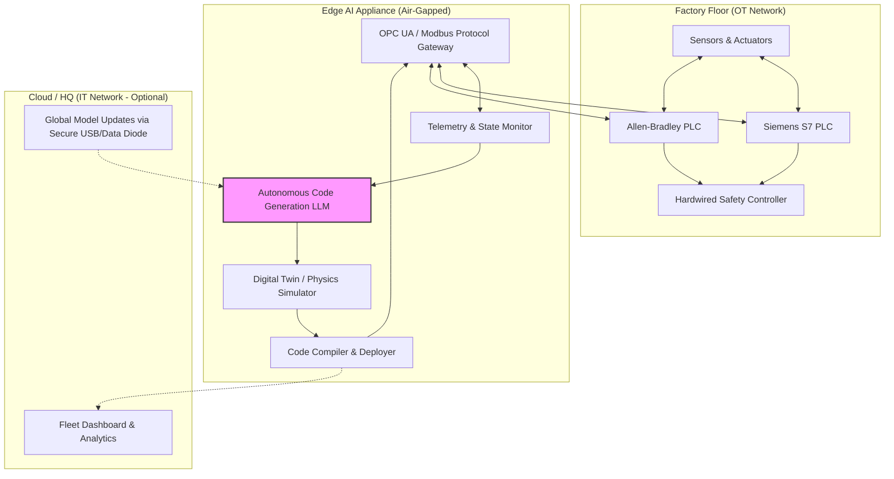
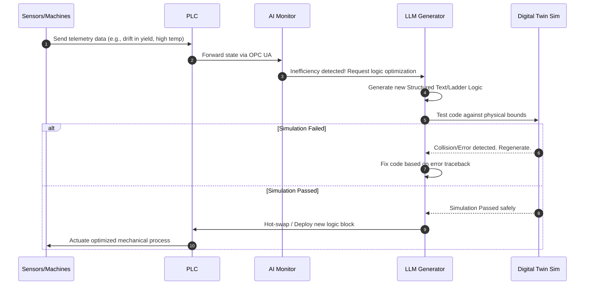

# Autonomous PLC Code Generator & Management System

This document outlines the high-level architecture, operational workflow, feature set, and development roadmap for the Autonomous PLC Management System. This system is designed to replace traditional automation engineering by dynamically generating, testing, and deploying Programmable Logic Controller (PLC) code in real-time.

## 🏗️ System Architecture Diagram

The architecture bridges the IT (Information Technology) and OT (Operational Technology) divide securely, utilizing an air-gapped Edge AI Appliance.

---

## ⚙️ How It Works (The Autonomous Loop)

The AI operates in a continuous Observe-Think-Simulate-Act loop. Here is how a logic adjustment is handled autonomously:

---

## 🌟 Feature Chart

| Feature | Description | Benefit |
| :--- | :--- | :--- |
| **Multi-Vendor Translation** | Translates logic seamlessly between Siemens (SCL), Rockwell/Allen-Bradley, and Beckhoff. | Eliminates vendor lock-in. A factory can mix and match hardware instantly. |
| **Zero-Downtime Hot Swapping** | Compiles and injects optimized code blocks into running PLCs without halting the production line. | Maximizes uptime and OEE (Overall Equipment Effectiveness). |
| **Pre-Deployment Digital Twin** | Every line of generated code is tested against a physics-based simulation of the factory floor. | Guarantees safety; prevents the AI from crashing robotic arms or causing mechanical failure. |
| **Air-Gapped Security** | The entire LLM inference engine runs locally on ruggedized edge servers. | Immune to external cyber-attacks; complies with strict industrial data privacy laws. |
| **Self-Healing Logic** | If a sensor breaks or a motor degrades, the AI automatically rewrites the control logic to compensate. | Eliminates emergency maintenance calls for automation engineers at 3 AM. |
| **Legacy Code Ingestion** | Reads decades-old, undocumented ladder logic and translates it into modern, optimized Structured Text. | Modernizes aging factories instantly without expensive human reverse-engineering. |

---

## 🗺️ Creation Roadmap (How we will build it)

### Phase 1: Data Acquisition & Foundation Model (Months 1-2)
*   **Action:** Aggregate massive datasets of open-source PLC code (GitHub, forums), proprietary equipment manuals, and standard industrial logic patterns.
*   **Action:** Fine-tune a base model (e.g., Llama-3 70B or DeepSeek-Coder) specifically on IEC 61131-3 languages (Ladder Logic, Structured Text, Function Block Diagram).

### Phase 2: Simulation & Safety Sandbox (Months 3-4)
*   **Action:** Develop the internal Digital Twin environment. The AI must be able to compile its own generated code and run it against a virtual machine simulator to check for logic loops or unsafe states.
*   **Action:** Integrate deterministic bounding constraints (e.g., hardcoded rules that the AI can *never* exceed certain speeds or temperatures).

### Phase 3: Hardware Integration & Protocols (Months 5-6)
*   **Action:** Build the translation layer using protocols like OPC UA, Modbus TCP, and PROFINET to allow the Edge Server to read state and push code to physical PLCs.
*   **Action:** Deploy the system on an industrial-grade edge server (e.g., NVIDIA IGX or ruggedized edge TPU).

### Phase 4: Pilot & Autonomous Mode (Months 7-8)
*   **Action:** Install the system in a low-risk manufacturing facility (e.g., a simple conveyor sorting system). 
*   **Action:** Run in "Copilot Mode" (human approves the code) before switching to full "Autonomous Mode."
